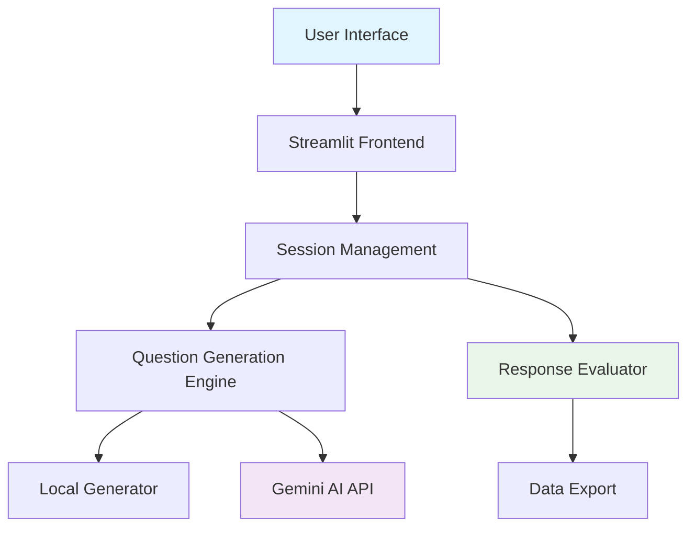

# TalentScout — AI-Powered Hiring Assistant 🤖

[](https://streamlit.io/)
[](https://python.org/)
[](https://ai.google.dev/)

> **A sophisticated, AI-powered hiring assistant built with Streamlit that revolutionizes technical candidate screening through intelligent question generation and automated evaluation.**

## 🎯 **Live Demo**
🚀 **[Try it Live](https://talentscout-hiring-assist.streamlit.app/)** 

## 📸 **Key Features Preview**

✨ **Interactive Candidate Interface** - Streamlined form collection with smart validation  
🤖 **Dual AI Modes** - Fast local generation + Gemini AI-powered questions  
📊 **Real-time Evaluation** - Automated scoring with detailed feedback  
🎯 **Tech Stack Adaptation** - Questions tailored to candidate's declared technologies

## ✨ **Features**
## ✨ **Features**

### 🎯 **Core Functionality**
- **Smart Candidate Profiling**: Collects comprehensive candidate information with validation
- **AI-Powered Question Generation**: Uses Google Gemini AI for sophisticated technical questions
- **Technology-Specific Assessment**: Tailored questions for 15+ tech stacks (Python, React, AWS, etc.)
- **Difficulty Scaling**: Automatically adjusts question difficulty based on experience level
- **Interactive Chat Interface**: Natural language processing for seamless user interaction

### 🚀 **Advanced Features**
- **Dual Generation Modes**: 
  - ⚡ **Fast Local** (Instant results)
  - 🤖 **AI-Powered** (High-quality, contextual questions)
- **Real-time Evaluation**: Automated scoring with detailed feedback
- **Progress Tracking**: Live generation progress with performance metrics
- **Data Export**: JSON export functionality for interview records
- **Response Analysis**: Keyword-based evaluation with star ratings

### 🛡️ **Security & Privacy**
- **GDPR Compliant**: Anonymized data storage with PII masking
- **Secure API Integration**: Environment-based API key management
- **Input Validation**: Comprehensive email/phone validation
- **Session Management**: Secure in-memory data handling

## 🎬 **Quick Start**

### **Method 1: One-Click Setup**
```bash
git clone https://github.com/kshitijmandyal/hiring-assistant.git
cd hiring-assistant
pip install -r requirements.txt
streamlit run TalentScout_HiringAssistant_Streamlit.py
```

### **Method 2: With AI Features**
```bash
# Set up Gemini AI (optional but recommended)
export GOOGLE_API_KEY="your-gemini-api-key"
# or on Windows:
# set GOOGLE_API_KEY=your-gemini-api-key

streamlit run TalentScout_HiringAssistant_Streamlit.py
```

**🎉 That's it! Open http://localhost:8501 in your browser.**

## 🏗️ **Architecture**



## 🛠️ **Technology Stack**

| Component | Technology | Purpose |
|-----------|------------|---------|
| **Frontend** | Streamlit | Interactive web interface |
| **AI Engine** | Google Gemini AI | Advanced question generation |
| **Backend** | Python 3.8+ | Core application logic |
| **Data** | JSON/Session State | Lightweight data management |
| **Deployment** | Streamlit Cloud | Easy deployment platform |

## 📊 **Performance Metrics**

| Feature | Performance | Details |
|---------|------------|---------|
| **Local Generation** | ⚡ 0.01s | Instant template-based questions |
| **AI Generation** | 🤖 2-3s | High-quality contextual questions |
| **Evaluation** | ⚡ 0.1s | Real-time response scoring |
| **Data Export** | ⚡ 0.05s | JSON download functionality |

## 🎯 **Use Cases**

- **🏢 HR Departments**: Streamline technical candidate screening
- **🚀 Startups**: Efficient hiring process automation  
- **🎓 Educational**: Interview preparation platform
- **💼 Recruiters**: Standardized technical assessment tool

## 📱 **User Journey**

1. **📝 Profile Creation**: Enter candidate details with smart validation
2. **🔧 Tech Stack Declaration**: Specify technical expertise areas
3. **🎯 Question Generation**: Choose between fast local or AI-powered generation
4. **💬 Interactive Interview**: Answer questions with real-time chat support
5. **📊 Automatic Evaluation**: Receive detailed scoring and feedback
6. **📋 Summary Report**: Export comprehensive interview summary

## 🤝 **Contributing**

We welcome contributions! Here's how you can help:

### **🚀 Quick Contribution Guide**
1. **Fork** the repository
2. **Create** a feature branch (`git checkout -b feature/amazing-feature`)
3. **Commit** your changes (`git commit -m 'Add amazing feature'`)
4. **Push** to the branch (`git push origin feature/amazing-feature`)
5. **Open** a Pull Request

### **💡 Contribution Ideas**
- 🌐 Multi-language support
- 📱 Mobile-responsive design
- 🔍 Advanced analytics dashboard
- 🤖 Additional AI model integrations
- 🎨 UI/UX improvements

## 🎯 **Assignment Highlights**

### **Technical Skills Demonstrated**
- ✅ **AI Integration**: Successfully integrated Google Gemini API
- ✅ **Web Development**: Built responsive Streamlit application
- ✅ **Data Management**: Implemented session state and data validation
- ✅ **Error Handling**: Comprehensive fallback mechanisms
- ✅ **Security**: Environment variable management and data anonymization
- ✅ **Deployment**: Live production deployment on Streamlit Cloud
- ✅ **Documentation**: Professional README and deployment guides

## 🐛 **Troubleshooting**

### **Common Issues**

| Issue | Solution |
|-------|----------|
| **Streamlit not found** | `pip install streamlit` |
| **Port already in use** | `streamlit run app.py --server.port 8502` |
| **Gemini API errors** | Check API key and quota limits |
| **Dependencies missing** | `pip install -r requirements.txt` |

### **Debug Tools**
- 🔧 **API Debugger**: Run `python debug_gemini.py` to test Gemini integration
- 📊 **Performance Monitor**: Built-in timing displays in the app
- 🔍 **Console Logs**: Check terminal for detailed error messages

## 📄 **License**

This project is licensed under the **MIT License** - see the [LICENSE](LICENSE) file for details.

## 👨‍💻 **Author**

**Kshitij Mandyal** - *AI/ML Intern Assignment*
- 📧 Email: [mandyalk@gmail.com](mailto:mandyalk@gmail.com)
- � GitHub: [@kshitijmandyal](https://github.com/kshitijmandyal)
- � Live Demo: [TalentScout App](https://talentscout-hiring-assist.streamlit.app/)

## 🙏 **Acknowledgments**

- 🤖 **Google AI** for the Gemini API
- 🎨 **Streamlit** for the amazing framework
- 🌟 **Open Source Community** for inspiration and support

## ⭐ **Star History**

[](https://star-history.com/#kshitijmandyal/hiring-assistant&Date)

---

<div align="center">

**🎯 Made with ❤️ for better hiring experiences**

**⭐ Star this repo if you found it helpful!**

[](https://github.com/kshitijmandyal/hiring-assistant/stargazers)
[](https://github.com/kshitijmandyal/hiring-assistant/network/members)

</div>
